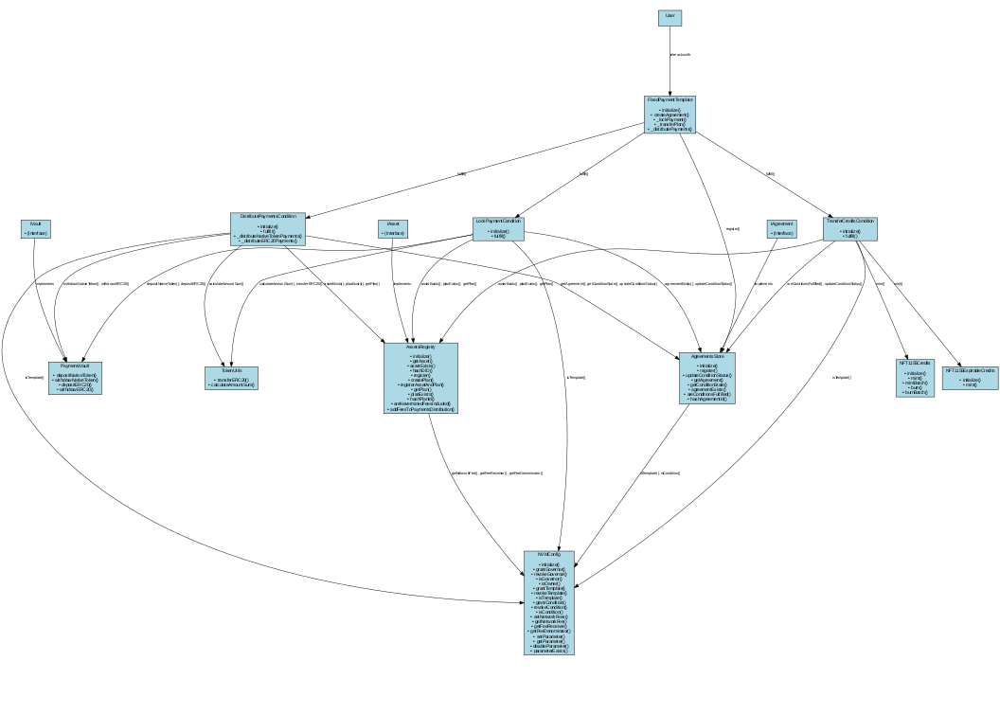

[](https://nevermined.io)

# Nevermined Protocol

> 💧 Smart Contracts implementation of Nevermined in Solidity
> [nevermined.io](https://nevermined.io)

[](https://github.com/nevermined-io/contracts-exp/actions/workflows/build.yml)

## Table of Contents

- [Nevermined Protocol](#nevermined-protocol)
  - [Table of Contents](#table-of-contents)
  - [Overview](#overview)
    - [Key Features](#key-features)
  - [Architecture](#architecture)
    - [Core Components](#core-components)
    - [Conditions System](#conditions-system)
    - [Agreement Templates](#agreement-templates)
    - [Contract Inheritance and Relationships](#contract-inheritance-and-relationships)
    - [Access Control System](#access-control-system)
  - [Setup and Installation](#setup-and-installation)
    - [Prerequisites](#prerequisites)
    - [Installation](#installation)
  - [Development Scripts](#development-scripts)
    - [Building and Compiling](#building-and-compiling)
    - [Testing](#testing)
    - [Local Development](#local-development)
    - [Code Quality](#code-quality)
    - [Deployment](#deployment)
  - [Contract Interaction Flow](#contract-interaction-flow)
  - [Detailed Function Reference](#detailed-function-reference)
    - [Asset Management](#asset-management)
    - [Agreement Management](#agreement-management)
    - [Payment Management](#payment-management)
    - [Credits Management](#credits-management)
  - [Upgradeability Pattern](#upgradeability-pattern)
  - [Contributors](#contributors)
  - [License](#license)

## Overview

Nevermined Smart Contracts form the core of the Nevermined protocol, enabling secure asset registration, access control, and payment management in a decentralized environment. This protocol facilitates the entire lifecycle of digital assets, from registration and pricing to access management and payment processing.

The Nevermined protocol allows users to:

- Register digital assets with flexible pricing models
- Set up various subscription and one-time payment plans
- Manage access rights through NFT-based credit systems
- Process both cryptocurrency and fiat payments
- Establish time-limited (expirable) and fixed-amount access rights
- Execute agreements between parties with automated condition fulfillment
- Distribute payments to multiple receivers with configurable fee structures

### Key Features

- **Asset Registration**: Register digital assets with customizable access plans
- **Agreement Management**: Create and manage agreements between parties with condition-based fulfillment
- **Payment Handling**: Secure escrow and distribution of payments
- **Access Control**: NFT-based credits system for managing access rights
- **Configurable Fees**: Network fee management for platform sustainability
- **Upgradeable Contracts**: Future-proof design with UUPS pattern
- **Multi-token Support**: Native cryptocurrency and ERC20 token support
- **Role-based Access**: Granular permissions management

## Architecture

The Nevermined Smart Contracts are organized around several core components:



### Core Components

1. **NVMConfig**
   - Central registry for roles, fees, and contract addresses
   - Manages access control and permissions
   - Stores configuration parameters
   - Provides role-based access control for critical operations
   - Supports upgradeable contracts through UUPS pattern

2. **AssetsRegistry**
   - Manages asset registration and metadata
   - Handles access plans and pricing configurations
   - Supports different pricing models (fixed price, fiat price, smart contract price)
   - Generates unique identifiers for assets and plans
   - Validates and enforces fee structures

3. **AgreementsStore**
   - Stores and tracks agreements between parties
   - Manages condition states and fulfillment
   - Provides agreement verification
   - Tracks dependencies between conditions
   - Ensures proper sequencing of condition fulfillment

4. **PaymentsVault**
   - Escrow for holding and releasing payments
   - Supports both native tokens and ERC20 tokens
   - Manages deposit and withdrawal permissions
   - Implements secure withdrawal patterns
   - Provides balance tracking for different token types

5. **NFT1155Credits**
   - ERC1155-based NFT implementation for access rights
   - Supports different credit types (expirable, fixed, dynamic)
   - Manages minting and burning of access tokens
   - Implements time-based expiration for credits
   - Controls redemption based on configurable rules

### Conditions System

The protocol uses a condition-based agreement system where specific conditions must be met before payments are released or access is granted:

- **LockPaymentCondition**: Handles locking payments in escrow
- **TransferCreditsCondition**: Manages the transfer of access credits
- **DistributePaymentsCondition**: Controls payment distribution to receivers
- **FiatSettlementCondition**: Manages off-chain fiat payment verification

### Agreement Templates

- **FixedPaymentTemplate**: Template for agreements with fixed payment terms
- **FiatPaymentTemplate**: Template for agreements with fiat payment terms

### Contract Inheritance and Relationships

The contracts follow a modular design with clear separation of concerns:

- Core contracts manage configuration, assets, agreements, and payments
- Template contracts orchestrate the agreement creation and condition fulfillment
- Condition contracts implement specific business logic for different agreement types
- Token contracts handle the minting, burning, and tracking of access rights

### Access Control System

The protocol implements a comprehensive role-based access control system:

- **OWNER_ROLE**: Full administrative control
- **GOVERNOR_ROLE**: Configuration management
- **CREDITS_MINTER_ROLE**: Ability to mint access credits
- **CREDITS_BURNER_ROLE**: Ability to burn access credits
- **DEPOSITOR_ROLE**: Ability to deposit funds into the vault
- **WITHDRAW_ROLE**: Ability to withdraw funds from the vault
- **FIAT_SETTLEMENT_ROLE**: Ability to verify fiat payments

## Setup and Installation

### Prerequisites

- Node.js (>= 22.x)
- Yarn (>= 1.22.x)
- Git
- Foundry (for advanced testing and deployment)

### Installation

```bash
# Clone the repository
git clone https://github.com/nevermined-io/contracts-exp.git
cd contracts-exp

# Install dependencies
yarn install

# Install Foundry (if not already installed)
curl -L https://foundry.paradigm.xyz | bash
foundryup
```

## Development Scripts

The project includes several scripts to help with development:

### Building and Compiling

```bash
# Install dependencies
yarn install

# Compile contracts
yarn compile
```

### Testing

```bash
# Run unit tests
yarn test

# Run integration tests
yarn test:integration

# Run tests with gas reporting
yarn test:gas

# Run test coverage
yarn coverage
```

### Local Development

```bash
# Start a local Anvil chain (Foundry)
anvil
```

### Code Quality

```bash
# Lint Solidity code
yarn lint

# Fix linting issues
yarn lint:fix

# Format code
yarn format

# Test coverage
yarn coverage

# Gas usage report
yarn test:gas
```

### Deployment

```bash
# Deploy contracts (general)
yarn deploy

# Deploy to local network
yarn deploy:local

# Deploy to Sepolia testnet
yarn deploy:sepolia
```

## Contract Interaction Flow

A typical interaction flow in the Nevermined protocol:

1. Asset owner registers an asset with pricing plans in the AssetsRegistry
2. Consumer creates an agreement using a template (e.g., FixedPaymentTemplate)
3. Payment is locked in the PaymentsVault (LockPaymentCondition)
4. Access credits are transferred to the consumer (TransferCreditsCondition)
5. Payments are distributed to receivers (DistributePaymentsCondition)

## Detailed Function Reference

### Asset Management

- `AssetsRegistry.register(bytes32 _didSeed, string memory _url, uint256[] memory _plans)`: Registers a new asset with associated plans
- `AssetsRegistry.createPlan(PriceConfig memory _priceConfig, CreditsConfig memory _creditsConfig, address _nftAddress)`: Creates a new pricing plan
- `AssetsRegistry.registerAssetAndPlan(...)`: Registers an asset and creates a plan in a single transaction

### Agreement Management

- `AgreementsStore.register(bytes32 _agreementId, address _agreementCreator, uint256 _planId, bytes32[] memory _conditionIds, ConditionState[] memory _conditionStates, bytes[] memory _params)`: Registers a new agreement
- `AgreementsStore.updateConditionStatus(bytes32 _agreementId, bytes32 _conditionId, ConditionState _state)`: Updates the status of a condition
- `AgreementsStore.areConditionsFulfilled(bytes32 _agreementId, bytes32 _conditionId, bytes32[] memory _dependantConditions)`: Checks if required conditions are fulfilled

### Payment Management

- `PaymentsVault.depositNativeToken()`: Deposits native tokens (ETH) to the vault
- `PaymentsVault.withdrawNativeToken(uint256 _amount, address _receiver)`: Withdraws native tokens from the vault
- `PaymentsVault.depositERC20(address _erc20TokenAddress, uint256 _amount, address _from)`: Records ERC20 token deposits
- `PaymentsVault.withdrawERC20(address _erc20TokenAddress, uint256 _amount, address _receiver)`: Withdraws ERC20 tokens from the vault

### Credits Management

- `NFT1155Credits.mint(address _to, uint256 _planId, uint256 _value, bytes memory _data)`: Mints credits for a plan
- `NFT1155ExpirableCredits.mint(address _to, uint256 _planId, uint256 _value, uint256 _secsDuration, bytes memory _data)`: Mints expirable credits
- `NFT1155Base.burn(address _from, uint256 _planId, uint256 _amount)`: Burns/redeems credits for a plan

## Upgradeability Pattern

The Nevermined contracts implement the UUPS (Universal Upgradeable Proxy Standard) pattern:

- All storage is isolated using ERC-7201 namespaced storage pattern
- Contracts inherit from AccessManagedUUPSUpgradeable for secure upgrades
- Initialization functions replace constructors for proper proxy initialization

## Contributors

This project exists thanks to all the people who contribute:

 <b>Aitor Argomaniz</b> - [@aaitor](https://github.com/aaitor) <br/>
 <b>Ankur Dubey</b> - [@ankurdubey521](https://github.com/ankurdubey521) <br/>
 <b>Enrique Ruiz</b> - [@eruizgar91](https://github.com/eruizgar91) <br/>

## License

```text
Copyright 2025 Nevermined AG

Licensed under the Apache License, Version 2.0 (the "License");
you may not use this file except in compliance with the License.
You may obtain a copy of the License at

   http://www.apache.org/licenses/LICENSE-2.0

Unless required by applicable law or agreed to in writing, software
distributed under the License is distributed on an "AS IS" BASIS,
WITHOUT WARRANTIES OR CONDITIONS OF ANY KIND, either express or implied.
See the License for the specific language governing permissions and
limitations under the License.
```
