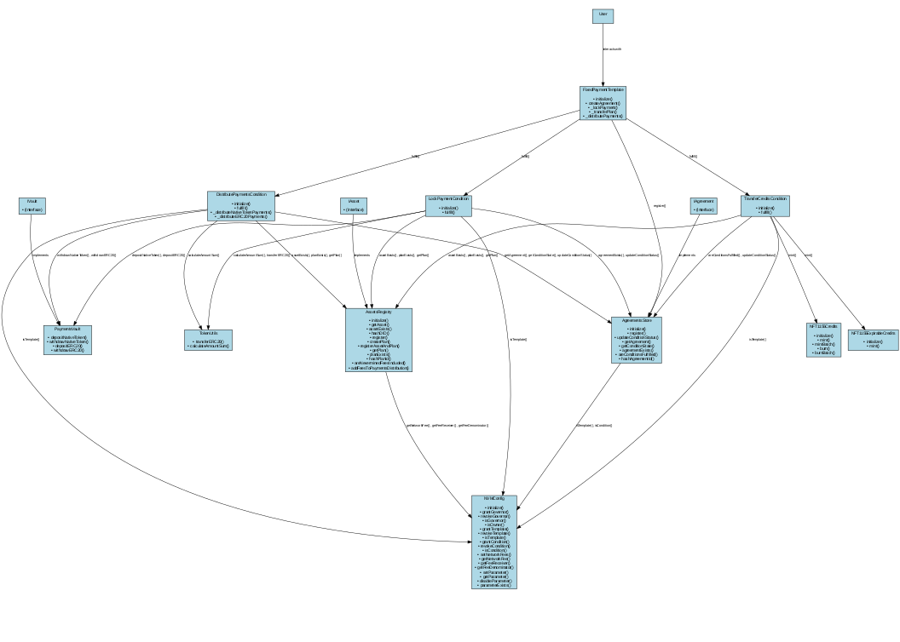

# Nevermined Smart Contracts Architecture

This document provides an overview of the Nevermined Smart Contracts architecture, outlining the main components and their interactions. It describes the relationships between different contracts and their methods.

## Architecture Diagram

The following diagram illustrates the logical architecture of the Nevermined Smart Contracts, showing the relationships between different contracts and their methods:

## Core Systems

The Nevermined Smart Contracts are organized into several core systems:

### 1. Access Control

The access control system manages roles and permissions for different contracts and users in the Nevermined protocol.

The key protocol is the **AccessManager** provided by **OpenZeppelin**. It implements role-based access control based on the roles defined in the **Roles.sol** contract. These roles are configured during the deployment and configuration phase (`scripts/deploy/`).

### 2. Protocol Configuration

Stores and manages the protocol configuration (initially payment fees).

**Key Contract:** `NVMConfig.sol`

### 3. Asset Management

The asset management system handles the registration and management of digital assets and their access plans. Access plans define the pricing and terms under which assets can be accessed or used.

**Key Contract:** `AssetsRegistry.sol`

This contract manages the registration of assets and payment plans, enabling asset owners to register their digital assets and define pricing and access terms.

**Interface:** `IAsset.sol`

Defines asset and plan data structures, including:

- **PriceType**: Enum of price types (`FIXED_PRICE`, `FIXED_FIAT_PRICE`, `SMART_CONTRACT_PRICE`)
- **CreditsType**: Enum for credit types (`EXPIRABLE`, `FIXED`, `DYNAMIC`)
- **DIDAsset**: Structure for asset information
- **PriceConfig**: Structure defining payment terms for a plan
- **CreditsConfig**: Structure defining credit properties for a plan

### 4. Agreement Management

The agreement management system handles the creation and tracking of agreements between parties.

**Key Contract:** `AgreementsStore.sol`
**Interface:** `IAgreement.sol`

### 5. Fixed Payment Template

This contract implements a template for fixed payment agreements, orchestrating the creation of agreements and the fulfillment of conditions.

**Key Contracts:**

- `FixedPaymentTemplate.sol`: Implements a fixed payment agreement template, allowing users to create agreements with fixed payment terms.
- `LockPaymentCondition.sol`: Manages the locking of payments for agreements, ensuring that funds are secured before proceeding with the agreement.
- `TransferCreditsCondition.sol`: Manages the transfer of access credits to users, minting NFTs that represent access rights.
- `DistributePaymentsCondition.sol`: Controls the distribution of payments to receivers once all required conditions are met.

### 6. Fiat Payment Template

This contract implements a template for fiat payment agreements, orchestrating the creation of agreements and the fulfillment of conditions.

**Key Contracts:**

- `FiatPaymentTemplate.sol`: Implements a fiat payment agreement template, allowing users to create agreements paid via fiat with an external provider (e.g., Stripe).
- `FiatSettlementCondition.sol`: Allows registration of settlements from external fiat providers.
- `TransferCreditsCondition.sol`: Manages the transfer of access credits to users, minting NFTs that represent access rights.

### 7. Payment Storage

The payment handling system manages the secure handling of payments within the Nevermined protocol.

**Key Contract:** `PaymentsVault.sol`
**Interface:** `IVault.sol`

This contract acts as an escrow for holding and releasing payments, supporting both native and ERC20 tokens.

### 8. Credits System

The credits system implements NFT-based representation of access rights. Credits represent access rights or usage quotas for digital assets.

**Key Contract:** `NFT1155Credits.sol`

This contract implements an ERC1155-based NFT for access rights, allowing for the minting and burning of credits.

**Key Contract:** `NFT1155ExpirableCredits.sol`

This contract extends the `NFT1155Credits` contract with expiration functionality, allowing credits to expire after a specified time.

### 9. Token Utilities

**Key Contract:** `TokenUtils.sol`

Provides utilities for token transfers and calculations, including fee calculation and token amount summation.
